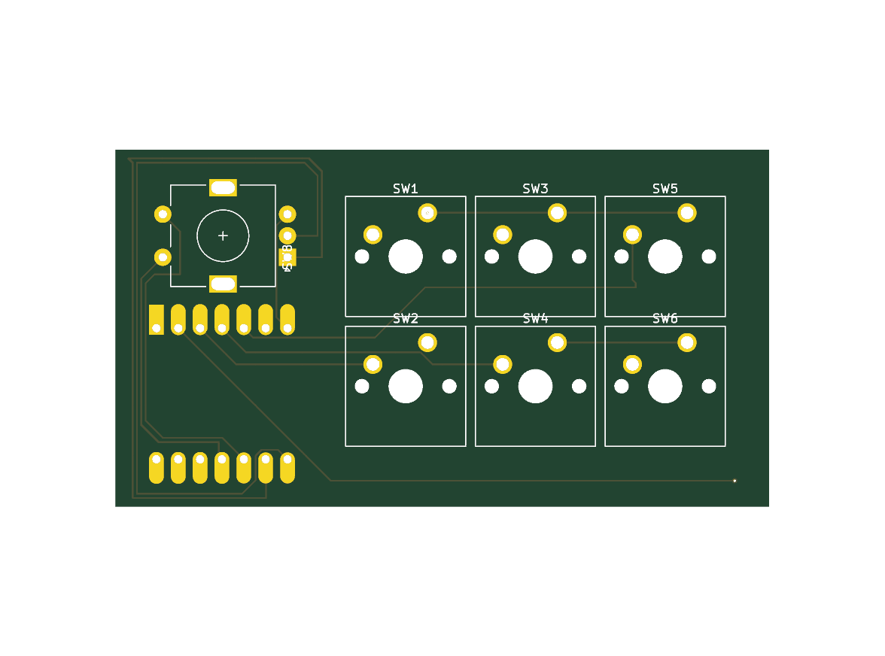
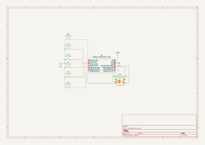
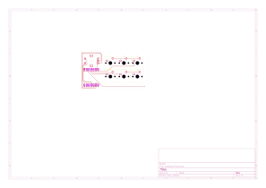
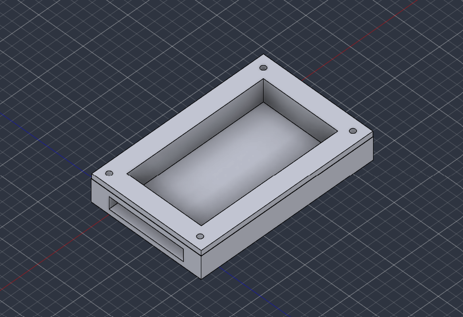

# Productivity Pad

A 6-key macropad with a rotary encoder, built for the [Hack Club Hackpad](https://hackpad.hackclub.com/) program.

## Overview



## Schematic



## PCB



## Case



Single-piece, fully 3D printed case (`CAD/hackpad_assembly.step`).

## Bill of Materials

| Ref | Part | Footprint | Qty |
|-----|------|-----------|-----|
| SW1-SW6 | Cherry MX-style switch | `SW_Cherry_MX_1.00u_PCB` | 6 |
| SW8 | Rotary encoder (w/ push switch) | `RotaryEncoder_Alps_EC11E-Switch_Vertical_H20mm` | 1 |
| U1 | Seeeduino XIAO | `XIAO-Generic-Hybrid-14P-2.54-21X17.8MM` | 1 |

Full generated BOM: [production/bom.csv](production/bom.csv)

## Firmware

Runs [KMK](https://github.com/KMKfw/kmk_firmware) on the Seeeduino XIAO. Keys are direct-wired to GPIO pins (no diode matrix). See [Firmware/main.py](Firmware/main.py) for the pin mapping (extracted from the schematic) and keymap.

## Repo structure

```
CAD/        complete case CAD (assembly + individual parts)
PCB/        KiCad project (schematic, PCB, project files)
Firmware/   KMK firmware source
production/ manufacturing files: gerbers.zip, PCB.step, bom.csv
docs/       README images
```

## Building it yourself

1. Order the PCB using [production/gerbers.zip](production/gerbers.zip)
2. 3D print / laser cut the case from [CAD/](CAD/)
3. Flash [Firmware/main.py](Firmware/main.py) to the XIAO via KMK/CircuitPython
4. Assemble and solder switches per the BOM above
